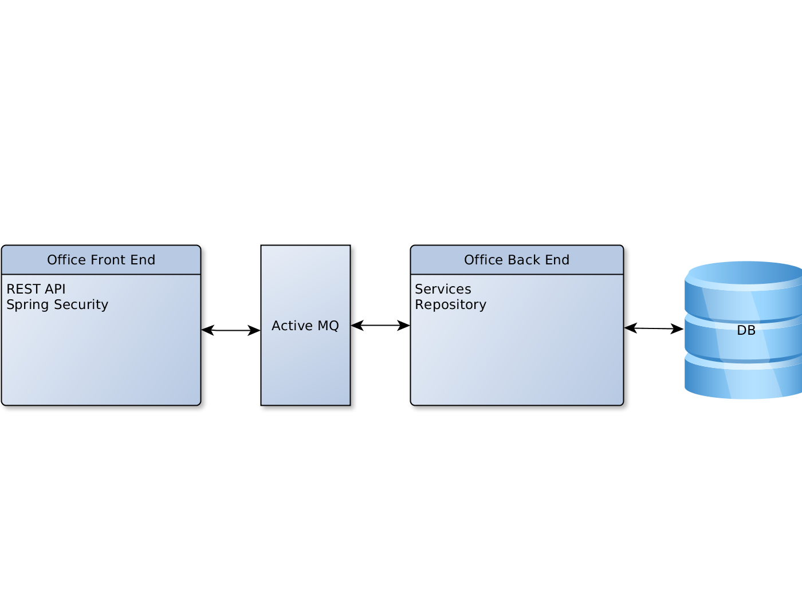
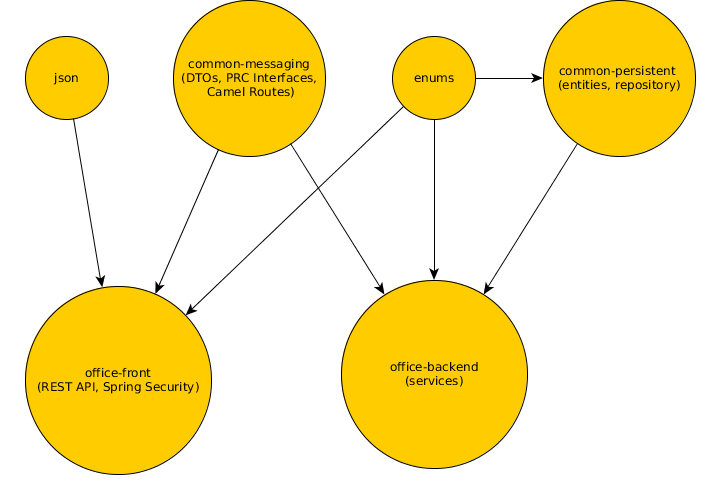

Multi module project with Apache Camel and Active MQ
===============================================

This is a quick demo of multi module maven project using following open source components:
 * Spring Framework, MVC, Security
 * Spring Data
 * FlywayDb
 * Dbunit
 * Rest Assured
 * Spring MVC tests
 * Apache Camel
 * Apache MQ

The main feature is to keep front module with REST API separated from the backend by Active MQ message broker.
Apache Camel provides "Producer" template to connect components via MQ with RPC style calls. It is quick and easy to start and
we can write some more complicated load-balancing solution later with Camel.

# Modules
* common-config - common Spring Framework dependencies
* common-json - json beans
* common-persistent - entities and Spring Data repositories.
Uses Flywaydb to organise and deploy database migrations (useful for some continuous integration).
* enums - just enums used in back end and front end
* common-messaging - common DTO, RPC interfaces and camel routes
* office-frontend - REST api to create\update users and companies. Uses Spring Security to protect API.
* office-backend - services
* integration-test - see next section.

Functional segregation of modules simplifies creation of new modules. E.g. other modules for backend using existing persistent
module. MQ connection between modules could be provided with just one messaging block. Etc.

# Integration tests
Starts embedded Jetty, HSQLDB, ActiveMQ on "mvn verify".
Tests both backend and front REST services using Rest Assured and DbUnit.
Contains expected data sets to compare with database during tests.
Backend is deployed to Jetty with HSQLDB instance at the beginning.
Then Flywaydb apply sql migrations and creates database structure.
Each integration test cleans up the DB and inserts data from test data sets.
After REST-services call database is compared with expected data set.
No need of any external database, MQ broker or any manual configuration.